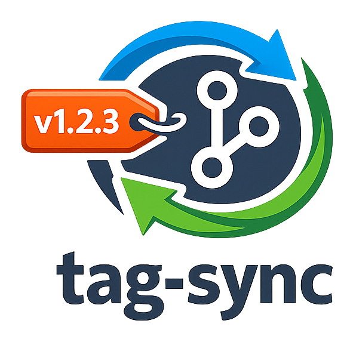

[](https://pypi.org/project/tag-sync/)
[](https://www.python.org/)
[](https://dusktreader.github.io/tag-sync/)

# tag-sync



_A CLI tool for syncing git tags with project versions._


## Super-quick Start

Requires: Python 3.13+

Install through pip:

```bash
pip install tag-sync
```

Publish a tag for the current package version:

```bash
tag-sync publish
```


## Documentation

The complete documentation can be found at the
[tag-sync home page](https://dusktreader.github.io/tag-sync).
